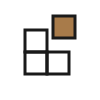
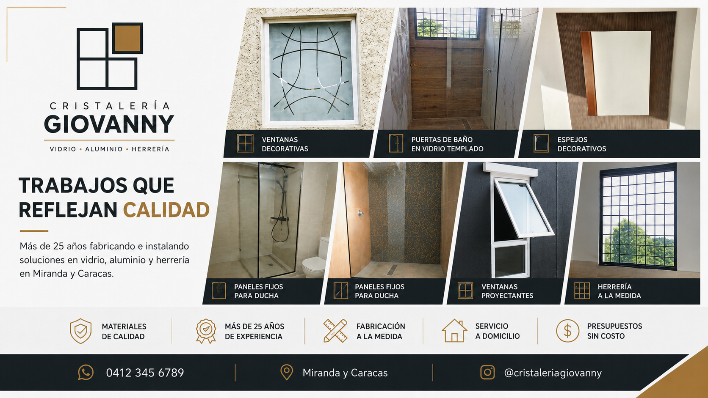

<div align="center">



# Cristalería Giovanny

**Vidrio · Aluminio · Herrería · Más de 25 años de oficio**

Sitio web institucional para un taller venezolano de fabricación e instalación de vidrio y aluminio en Miranda y Caracas.

[](https://developer.mozilla.org/es/docs/Web/HTML)
[](https://developer.mozilla.org/es/docs/Web/CSS)
[](https://developer.mozilla.org/es/docs/Web/JavaScript)
[](https://diegoalegil.github.io/cristaleria-giovanny/)
[](LICENSE)
[](#)

### [→ Ver demo en vivo](https://diegoalegil.github.io/cristaleria-giovanny/)

</div>

<br>



<br>

## Sobre el proyecto

Landing page de una sola página orientada a la conversión por WhatsApp para un cliente real. **Mobile-first** (~90% del tráfico esperado es móvil), sin frameworks ni build tools — solo HTML semántico, CSS moderno y JavaScript vanilla.

El logo de la marca, hecho de cuatro paneles con el superior derecho elevado en bronce, representa una ventana proyectante — el servicio estrella del taller.

## Características

| | |
|---|---|
| **Mobile-first** | Diseñado y probado primero en 375 px; layout grid responsive a 720 px y 900 px |
| **CTA dominante** | WhatsApp en header, hero, tarjetas de servicio, banner y botón flotante con pulse animation |
| **Galería + lightbox** | 6 trabajos del cliente; lightbox accesible con prev/next, Esc y flechas |
| **Carrusel táctil** | 10 testimonios con scroll-snap, autoplay y pausa al tocar/hover/focus |
| **WebP universal** | `<picture>` con WebP + fallback JPG, preload + `fetchpriority` en el LCP |
| **Preloader de marca** | Los 4 paneles del logo animan al cargar; el panel bronce se "proyecta" al final |
| **SEO local** | Schema.org `LocalBusiness`, Open Graph, sitemap, robots, canonical |
| **Accesibilidad** | `lang="es-VE"`, skip-link, foco visible, ARIA labels, `prefers-reduced-motion` |

## Stack

| Capa | Tecnología | Por qué |
|---|---|---|
| Marcado | HTML5 semántico | SEO y accesibilidad nativos |
| Estilos | CSS3 (Custom Properties, Grid, Flexbox) | Control total, cero dependencias |
| Lógica | JavaScript vanilla (IIFE, IntersectionObserver) | Ligero y portable |
| Tipografía | Fraunces + Inter Tight (Google Fonts) | Display elegante + cuerpo legible |
| Hosting | GitHub Pages | Gratis y atado al repo |
| Imágenes | WebP con fallback JPG | Hasta 60% más livianas |

## Estructura

```
cristaleria-giovanny/
├── index.html               Landing completa con head SEO + Schema.org
├── css/styles.css           Variables, reset, layout, 20 secciones temáticas
├── js/script.js             Menú móvil, lightbox, carrusel, preloader
├── img/
│   ├── logo.svg             Logo inline (4 paneles, ventana proyectante)
│   ├── favicon.svg
│   ├── hero.jpg/.webp       Imagen LCP
│   ├── preview.png          Imagen usada en este README
│   ├── *.jpg/.webp          Galería del taller (6 trabajos)
│   └── marketing/           Flyers promocionales (no se usan en el sitio)
├── docs/
│   ├── PROJECT.md           Brief completo del proyecto
│   └── FIXES.md             Plan de la iteración 1
├── robots.txt
├── sitemap.xml
└── LICENSE
```

## Correr localmente

No requiere build ni `npm install`:

```bash
git clone https://github.com/diegoalegil/cristaleria-giovanny.git
cd cristaleria-giovanny

# Servir estático (cualquiera funciona)
python3 -m http.server 8000
# o
npx http-server -p 8000

# Abrir http://localhost:8000
```

## Autor

**Diego Alegil** — Estudiante de Desarrollo de Aplicaciones Multiplataforma (DAM).

[](https://github.com/diegoalegil)

## Licencia

MIT © 2026 Diego Alegil — ver [LICENSE](LICENSE).
